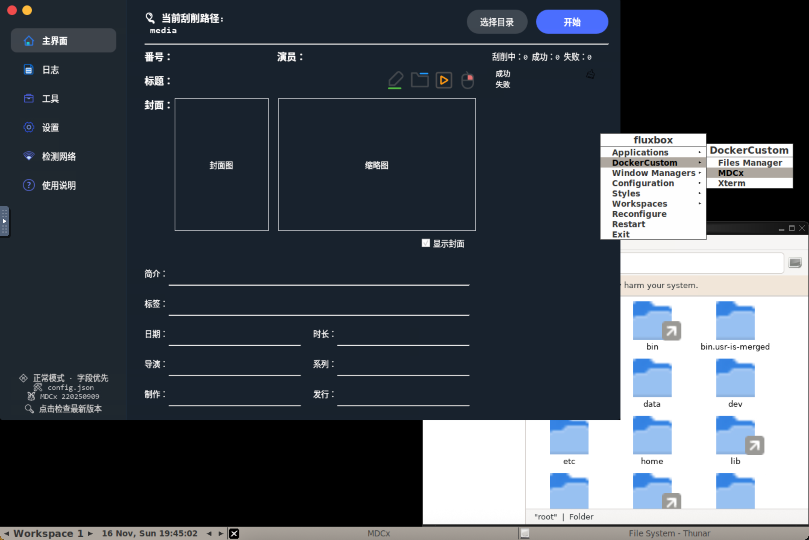

# MDCx-docker

[](https://hub.docker.com/r/watercalm/mdcx-docker)
[](https://hub.docker.com/r/watercalm/mdcx-docker)

因为目前手边的电脑不是Windows系统，所以之前一直使用的是 [stainless403/mdcx-builtin-gui-base](https://hub.docker.com/r/stainless403/mdcx-builtin-gui-base) 的版本。

但自从 [MDCx](https://github.com/sqzw-x/mdcx) 更新版本之后，docker版本一直也没更新。而且我之前也是在飞牛OS上部署的，会导致之前的docker容器无法正常使用。

而 MDCx 也一直没编译macOS的x86/64版本和Linux的版本，所以就自己在Ubuntu 24.04下clone了代码，构建了一版适用于Ubuntu系统的二进制版本。如果需要这个二进制文件，可以直接下载 `app/MDCx` 这个文件。

再参考了 [bandi13/gui-docker](https://github.com/bandi13/gui-docker) 这个项目，将 MDCx 放了进去

但说实话，好像v2版本并没有之前的版本好用╮(╯▽╰)╭

---

## 运行

https://hub.docker.com/r/watercalm/mdcx-docker

容器使用很简单，以下为 docker run 的示例

```bash
docker run -d \
  --name MDCx \
  --shm-size=256m \
  -p 5901:5901 \
  -p 5900:5900 \
  -e VNC_PASSWD="123456" \
  -e TZ=Asia/Shanghai \
  -v $(pwd)/data:/data \
  -v /path/to/volume/:/volume1 \
  watercalm/mdcx-docker:220250909
```

- VNC服务的端口是 `5900`，可以用vnc客户端访问
- noVNC的端口是 `5901`，浏览器 `http://ip:5901/` 访问
- VNC_PASSWD 环境变量默认为`123456`，可以根据自己喜好修改
- 容器内 `/data` 目录，会存放MDCx的配置文件，可以映射出来做持久化。根据 MDCx 的特性，如果没有相关的配置文件，会自己生成。
- 最后就是把媒体目录映射到容器内，自己能找到就行

---

## 使用



正常情况下，启动容器后会自动运行 MDCx。

若使用过程中不小心关闭了，可以在桌面通过右键菜单 `DockerCustom -> MDCx` 来手动启动，启动比较慢，需要多等一会儿。

除此之外，也内置了一个简单的文件管理器，方便管理文件。
